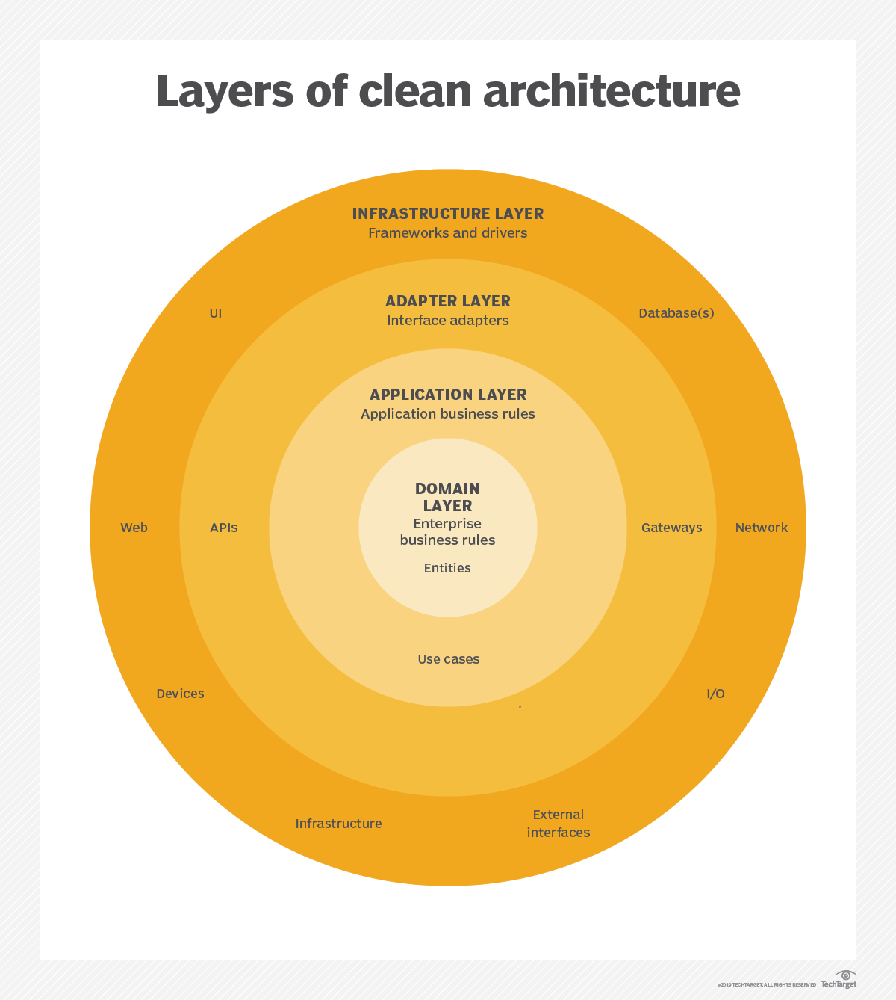

# Curso de Clean Code, Refactoring & Clean Architecture

# 🚀 Tecnologias
Em todos os exemplos e principalmente na correção de cada etapa do nosso projeto vamos utilizar

- JavaScript
- TypeScript
- Node.js
- Jest
- PostgreSQL

## 🎨 Design Patterns

## ✅ Resultados Esperados
Ao final do curso é esperado que você:

- Tenha desenvolvido um olhar mais crítico e profissional em relação ao desenvolvimento de software, elevando seu nível de maturidade.
- Saiba aplicar diversas técnicas de Clean Code e Refactoring com o objetivo de tornar o código mais limpo e compreensível
- Conheça vários Design Patterns e entenda como eles podem ajudar a criar código mais desacoplado e manutenível
- Entenda como desenvolver utilizando Test-Driven Development
- Domine os princípios da Programação Orientada a Objetos
- Saiba como estruturar a arquitetura da sua aplicação utilizando Clean Architecture e Domain-Driven Design
- Conheça Event Sourcing e CQRS para implementar funcionalidades orientadas a eventos
- Entender os princípios de Event-Driven Architecture
- Entender SOLID de uma vez por todas
- Ver na prática a diferença entre MVC, MVP e MVVM
- Se torne uma pessoa muito mais confiante no dia a dia de trabalho, em entrevistas de emprego, principalmente se estiver querendo alavancar a sua carreira
- Busque fomentar um ambiente de trabalho baseado na qualidade dentro da sua equipe
- Com certeza, mesmo que você não tenha experiência com JavaScript e TypeScript, vai sair dominando os principais conceitos da linguagem